> #### Notice
> This guide always refers to the latest version of the OpenSky Network Kit image. We strongly recommend always having the latest image installed. You can download it [here](https://opensky-network.org/files/downloads/osky-kit_240218.img.xz). Please refer to  the "Updating Your Receiver" section of this guide for details on the update process.

## Contents

  * [Introduction](#introduction)
  * [Overview](#overview)
  * [Setup](#setup)
    * [Assembling the Receiver](#assembling-the-receiver)
    * [Preparing the SD Card](#preparing-the-sd-card)
        * [Mounting the SD Card With Your Computer](#mounting-the-sd-card-with-your-computer)
        * [Config - Antenna Position](#config---antenna-position)
        * [Config - OpenSky Network User Name](#config---opensky-network-user-name)
        * [Enabling SSH](#enabling-ssh)
    * [First Boot](#first-boot)
    * [Connecting to Your Receiver](#connecting-to-your-receiver)
        * [Determining the IP Address of Your Receiver](#determining-the-ip-address-of-your-receiver)
        * [Accessing the Web Interface of the Receiver](#accessing-the-web-interface-of-the-receiver)
        * [Connecting via SSH](#connecting-via-ssh)
        * [Changing Your Password](#changing-your-password)
        * [Network Setup With "nmtui"](#network-setup-with-"nmtui")
  * [Updating Your Receiver](#updating-your-receiver)
    * [Flashing the Firmware Image]()
    * [After Updating - Before Powering Up Your Receiver!]()
  * [Antenna Positioning](#antenna-positioning)

-----

# Introduction

This guide explains how to assemble and setup your OpenSky Network Kit. After following this guide your kit will be connected to the OpenSky Network and you will be able to view the data the receiver is collecting by logging into your OpenSky profile on [https://opensky-network.org](https://opensky-network.org). The kit can be purchased through our partner [https://shop.jetvision.de](https://shop.jetvision.de).

# Overview


The OpenSky kit consists of the following parts:

##### (1) The RaspberryPi
  * 1x RaspberryPi 3 Model B *(A)*
  * 1x RaspberryPi Universal Power Supply *(B)*
  * 1x big chip cooler *(C)*
  * 1x small chip cooler *(D)*
  
##### (2) The Case
  * 1x OpenSky RaspberryPi case *(E)*, *(F)*, *(G)*
  * 4x screws + 1x spare screw *(H)*
  
##### (3) 1x SD card containing the OpenSky receiver image

##### (4) 1x RTL-SDR USB dongle

##### (5) 1x Jetvision A3 ADS-B antenna 1090 MHz

##### (6) 1x Antenna mounting backet

##### (7) 1x 15m low loss coax cable

# Setup

## Assembling the Receiver

Remove the protection cardboard from the bottom of the coolers (C) and (D) and place them onto the chips of the RaspberryPi (A):

 

Take the RPi (A) and place it onto the bottom part of the case (E). You will notice that the four screwholes of the RPi will be aligned with the screwholes in (E). The best way to insert the RPi is to push the 3.5 mm audio jack into the designated hole in the case (see the red circle below) and then push down the RPi, until it sits perfectly.

 

Gently push the rear panel (G) of the case into position and make sure the SD card slot is on the bottom (see the red circle below).

 

Place the top part of the case (F) onto the RPi and insert the screws (H) through the holes on the bottom.

 

## Preparing the SD Card

Before inserting the SD card (3) and powering up your receiver for the first time you should edit the configuration file and set the correct position, as well as your OpenSky Network user name. You can also enable SSH, if you wish to do so. The following sections describe the necessary step.

#### Mounting the SD Card With Your Computer

The partition with the label "boot" on the SD card is formatted with FAT32. So you can access it with any common operating system.

###### Linux

Insert the SD card. It should now show up in the list of block devices, so type the following command:
```bash
lsblk -o NAME,SIZE,TYPE,MOUNTPOINT,LABEL
```


If your SD card is there the output should look something like this:

```
NAME    SIZE TYPE MOUNTPOINT LABEL
sdb    14,9G disk            
├─sdb2 14,8G part            
└─sdb1 41,8M part            boot
sda      80G disk            
└─sda1   80G part /
```

So the SD card is available at `/dev/sdb`. First prepare the mount point by creating a directory `boot` at `/mnt/`:

```bash
sudo mkdir /mnt/boot
```

Then mount the partition to that directory:

```bash
sudo mount /dev/sdb1 /mnt/boot
```

Switch to the mount point and list the files:

```bash
cd /mnt/boot && ls -l
```

The `ls -l` command should output something like this:

```
total 21060
-rwxr-xr-x 1 root root   15830 Feb 24 07:57 bcm2708-rpi-0-w.dtb
-rwxr-xr-x 1 root root   15367 Feb 24 07:57 bcm2708-rpi-b.dtb
-rwxr-xr-x 1 root root   15626 Feb 24 07:57 bcm2708-rpi-b-plus.dtb
-rwxr-xr-x 1 root root   15086 Feb 24 07:57 bcm2708-rpi-cm.dtb
-rwxr-xr-x 1 root root   16693 Feb 24 07:57 bcm2709-rpi-2-b.dtb
-rwxr-xr-x 1 root root   17794 Feb 24 07:57 bcm2710-rpi-3-b.dtb
-rwxr-xr-x 1 root root   16550 Feb 24 07:57 bcm2710-rpi-cm3.dtb
-rwxr-xr-x 1 root root   50248 Feb 24 07:57 bootcode.bin
-rwxr-xr-x 1 root root     190 Feb 24 10:40 cmdline.txt
-rwxr-xr-x 1 root root    1590 Sep  7 17:05 config.txt
-rwxr-xr-x 1 root root   18693 Feb 24 07:57 COPYING.linux
-rwxr-xr-x 1 root root    2578 Feb 24 07:57 fixup_cd.dat
-rwxr-xr-x 1 root root    6551 Feb 24 07:57 fixup.dat
-rwxr-xr-x 1 root root    9694 Feb 24 07:57 fixup_db.dat
-rwxr-xr-x 1 root root    9694 Feb 24 07:57 fixup_x.dat
-rwxr-xr-x 1 root root     145 Sep  7 17:54 issue.txt
-rwxr-xr-x 1 root root 4579632 Feb 24 07:57 kernel7.img
-rwxr-xr-x 1 root root 4379152 Feb 24 07:57 kernel.img
-rwxr-xr-x 1 root root    1494 Feb 24 07:57 LICENCE.broadcom
-rwxr-xr-x 1 root root   18974 Sep  7 17:54 LICENSE.oracle
drwxr-xr-x 2 root root     512 Feb 24 09:46 opensky
drwxr-xr-x 2 root root   10240 Feb 24 07:58 overlays
-rwxr-xr-x 1 root root  667460 Feb 24 07:57 start_cd.elf
-rwxr-xr-x 1 root root 4956676 Feb 24 07:57 start_db.elf
-rwxr-xr-x 1 root root 2820196 Feb 24 07:57 start.elf
-rwxr-xr-x 1 root root 3904228 Feb 24 07:57 start_x.elf
drwxr-xr-x 2 root root     512 Feb 28 18:19 System Volume Information
```

You are now ready do edit the files as described in the following sections.


###### Windows

  Insert the SD card. One partition can't be read with Windows because Windows does not know the file system, which is why it will probably ask you to format it. If it does, click "Cancel":  
   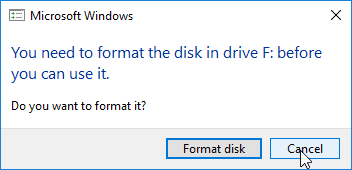  
   The card should now show up in your Windows Explorer in the section "This PC" as the partitions "boot" and "SD Card":  
   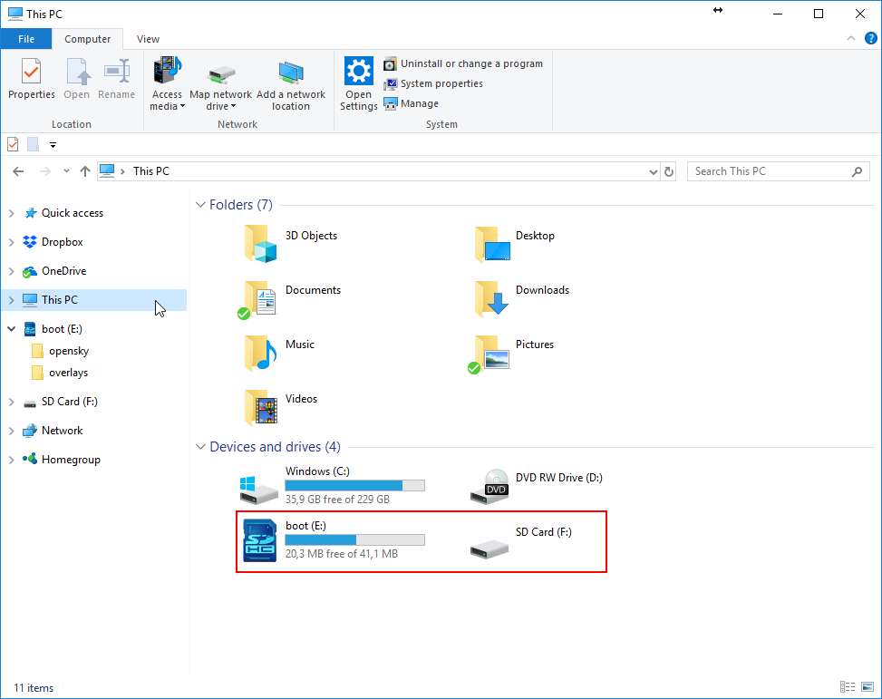  
  Double click the `boot` partition, which should look like this:
   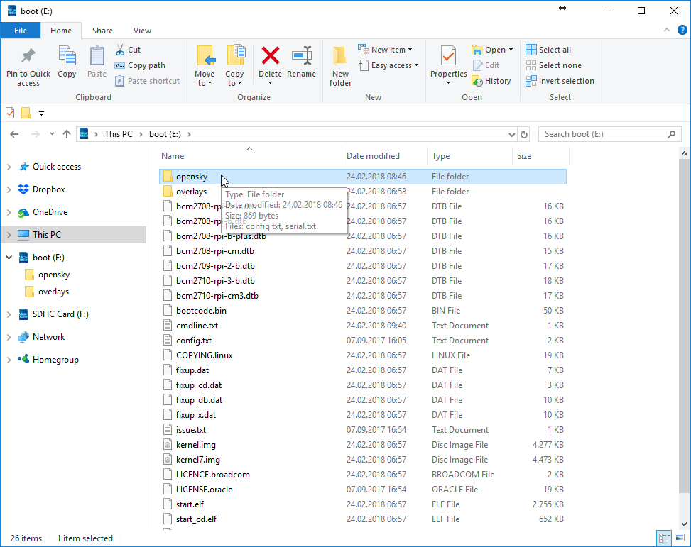  
  You are now ready to edit the files as described in the following sections.

#### Config - Antenna Position

After following the steps in section "[Mounting the SD Card With Your Computer](#mounting-the-sd-card-with-your-computer)" you should be in the root directory of the `boot` partition. Open the file `opensky/config.txt` with your favorite text editor. The file should look like this:

 ```
 # Please fill in the following parameters /before/
 # you boot the device for the first time. Latitude
 # and longitude are in decimal degrees. Altitude is
 # in meters. Use your smart phone or Google Maps to
 # estimate the location of your antenna with an
 # accuracy of about 4 decimal points.
 
 [GPS]
 Latitude=0
 Longitude=0
 Altitude=0
 
 # Enter your OpenSky username here. If you don't have
 # an account yet, register on http://opensky-network.org.
 # This receiver will be _automatically_ added to your
 # profile once you enter your username here.
 
 # Note: remove the '#' character before 'Username'
 
 [IDENT]
 #Username = [your username goes here]
 ```
 
You can use [Google Maps](https://maps.google.com) to determine the latitude and longitude of the antenna. Simply right-click on the location of where your antenna will be mounted (not the position of the receiver-case), select "What's here?" in the context menu and read the lat/lng information from the small popup in the bottom middle:

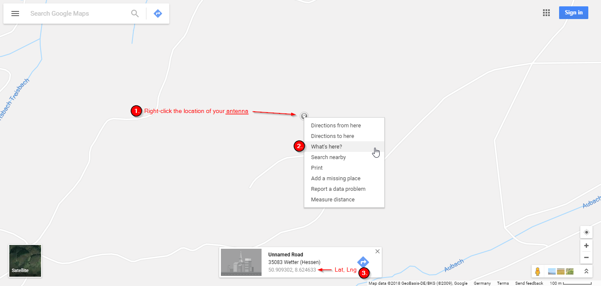 

Latitude and longitude values with at least 4 fractional digits are preferable. So Google Maps definitely provides sufficient accuracy if the correct location is selected. The online tool [https://www.daftlogic.com/sandbox-google-maps-find-altitude.htm](https://www.daftlogic.com/sandbox-google-maps-find-altitude.htm) uses the Google Maps API to determine the altitude. Use this to determine the altitude of your antenna in meters. Don't forget to take the height of the building into account, if you mount your antenna on a roof.
Instead of using different online tools you can also download [Google Earth](https://www.google.de/intl/de/earth/) ([Google Earth](https://www.google.de/intl/de/earth/)) and use the 3D mode to determine the exact coordinates of your antenna, already including the height of the building.

#### Config - OpenSky Network User Name

Also, in order to make sure that your receiver will get assigned to your user account when it connects to the OpenSky Network for the first time, you have to set your user name at the bottom of the same file we added theh receiver location in the previous section. Don't forget to remove the `#` at the beginning of the line. After editing the lines they should look like this (replace `yourusername` with your own username):

```
 [IDENT]
 Username = yourusername
 ```

#### Enabling SSH

After following the steps in section "[Mounting the SD Card With Your Computer](#mounting-the-sd-card-with-your-computer)" you should be in the root directory of the `boot` partition. By default SSH is deactivated for your receiver. It can easily be turned on by creating a file named "ssh" in the root directory. 

###### Linux

Create the file with the `touch` command:

```bash
sudo touch ssh
```

Flush all pending I/O operations:
```bash
sync
```

> #### IMPORTANT
> Make sure to change the default password as soon as possible. How to change your password is described in section "[Changing Your Password](#changing-your-password)".

###### Windows

After following the steps in section "[Mounting the SD Card With Your Computer](#mounting-the-sd-card-with-your-computer)" you should be in the root directory of the `boot` partition. Right click, choose `New` in the context menu and click `Text Document`.

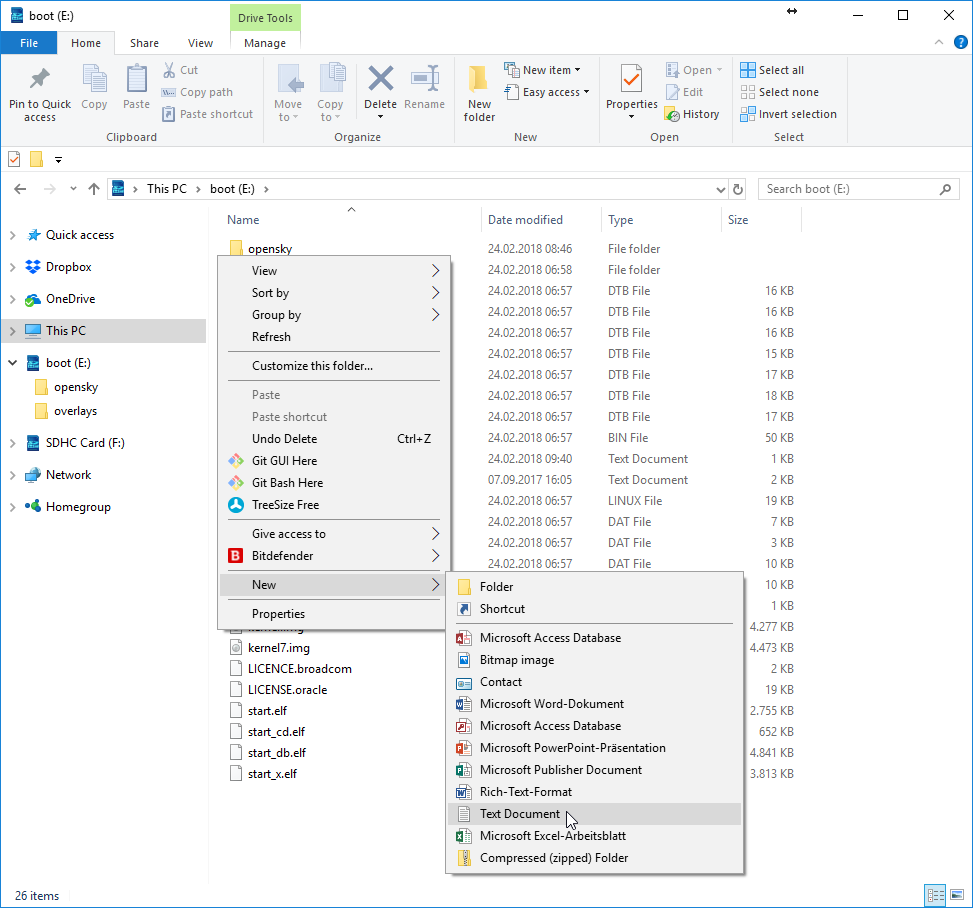 

A new file will appear, waiting to be renamed. Select the whole filename, including the `.txt`:

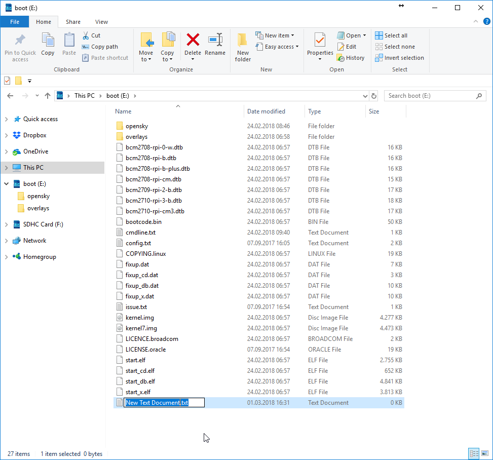 
 
Type `ssh` and submit by pressing the return key. Windows will complain that you are trying to change the file name extension. Submit by clicking `Yes`

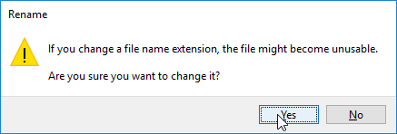 

The new ssh file should now have been created an should look like this:

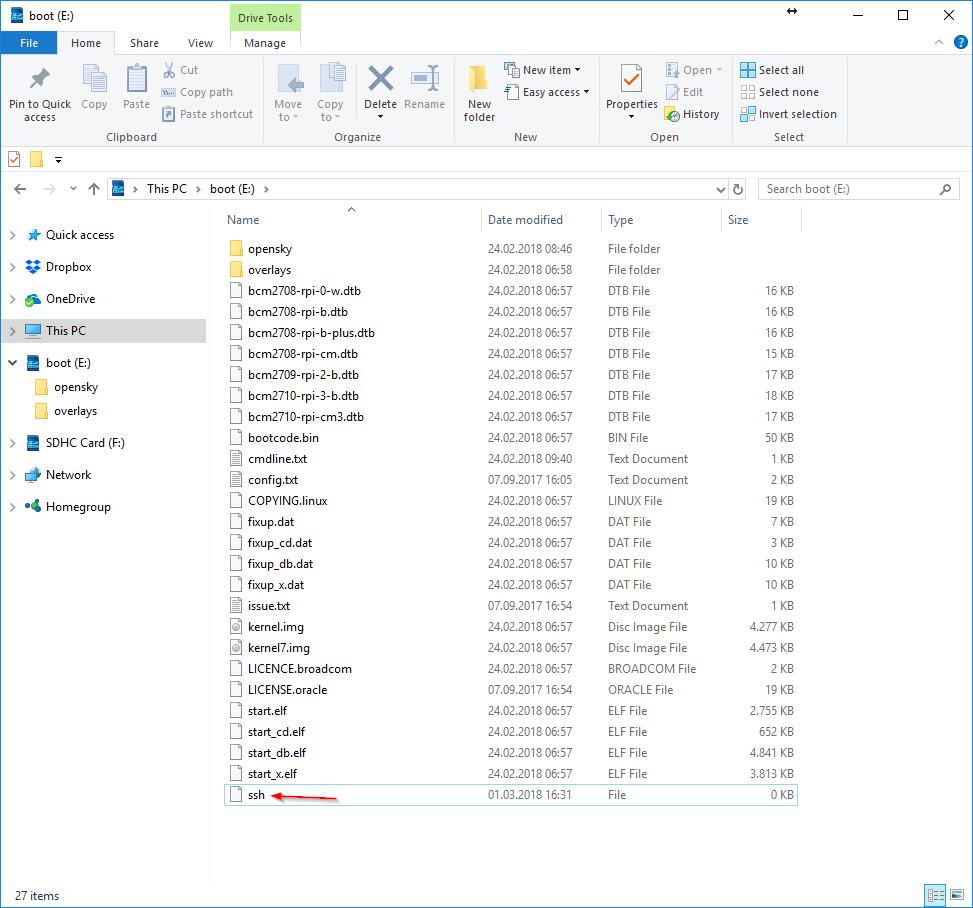 

Safely remove the SD card to flush all pending I/O operations by selecting the device in the eject menu in the Windows Infobar on the bottom right of your screen. The eject menu is available by right-clicking the small USB stick icon:  
   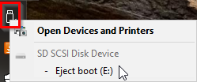

> #### IMPORTANT
> Make sure to change the default password as soon as possible. How to change your password is described in section "[Changing Your Password](#changing-your-password)".

## First Boot

After editing the configuration file, eject the SD card from your computer and insert it into the RaspberryPie:

 

Remove the plastic caps from the RTL-SDR dongle (4) and plug it into one of the USB ports on the RaspberryPi:

 

Connect the coax cable (5), the power supply (B) and your local network via a LAN cable. The LAN cable is not included in the OpenSky kit:

 

The RaspberryPi should be powering up, which is indicated by an LED behind the rear panel of the case or the LAN traffic indicators on the LAN port.

The first boot of your receiver always takes a little longer than any normal boot afterwards will, because the receiver performs the final setup steps. As soon as it has successfully obtained an IP address via DHCP, the receiver contacts the servers of the OpenSky Network for the first time and gets assigned a unique serial number. After a few minutes at most the device starts collecting data and should be accessible from the LAN.

## Connecting to Your Receiver

The receiver is configured to attempt a connection via DHCP, which is the appropriate configuration in most cases. Simply connect the device to your local network via a LAN cable and moments later it should automatically have established a connection. If your LAN has access to the Internet the receiver will instantly start streaming data to the OpenSky Network. For details on how to access your receiver via the LAN, please refer to the following sections:
    
   1. [Determine the IP Address of Your Receiver](#determining-the-ip-address-of-your-receiver)
   2. [Accessing the Web Interface of the Receiver](#accessing-the-web-interface-of-the-receiver)

If you wish to operate your receiver in a network without DHCP server or if you prefer some other configuration, you will have to use a LAN with DHCP server first to log on to the device via SSH and perform the network setup using the tool *nmtui*. Please refer to the following sections for details on how to perform the necessary steps:

   1. [Enabling SSH](#enabling-ssh)
   2. [Determining the IP Address of Your Receiver](#determining-the-ip-address-of-your-receiver)
   3. [Connecting via SSH](#connecting-via-ssh)
   4. [Network Setup With "nmtui"](#network-setup-with-"nmtui")

#### Determining the IP Address of Your Receiver

To access the web interface of the receiver you need to find out its IP address. In case it was assigned by a DHCP server your best bet is to search the network for a host called `opensky` because that is the default hostname of your receiver when you set it up. The command `nslookup` is preinstalled on Windows, Ubuntu and Mac OS X. Unless you have not set up some specific outside-LAN DNS server for your computer, this command should do the trick. Follow these steps to get the IP address:

###### Linux

 1. Open a terminal 
 2. a) type `nslookup opensky`
   
    b) In case `nslookup` is not installed on your Linux distribution, try `getent hosts opensky | awk '{ print $1 }'`. The command should print the IP address of your receiver to the console, for example `192.168.178.137`.

###### Windows

 1. Open the command shell. You can either 
    
    a) press Windowskey-R, then type `cmd` and finally press the return key
    
    b) *or* open the Windows start menu, then type `cmd` and finally press the return key
    
 2. When the command line shell has opened up, type `nslookup opensky` and submit the command by pressing the return key
 
###### Mac OS X

 1. Open the terminal. Press CMD-Space, type `Terminal` and select the Terminal app.
 
 2. When the terminal has opened up, type `nslookup opensky` and submit the command by pressing the return key
 
-----
  
The `nslookup` command should print some information to the console, which should look somewhat like this:

 

In this case the IP address of your receiver would be `192.168.178.137`.

#### Accessing the Web Interface of the Receiver

Open up your favorite internet browser and type the ip address to the address line. The webinterface should open up:

 

In the "Links"-menu you will find the option "Your OpenSky Receiver Profile". Click it and your public OpenSky Network profile will open up: 


 

The big number on the top left is the serial number of your receiver. In the image above the serial number is `-1408237066`.

#### Connecting via SSH

If you have enabled SSH on your receiver as described in section "[Enabling SSH](#enabling-ssh)" and if your computer is on the same network as your receiver then you can log on via SSH. By default the login credentials are

```
    user: pi
    password: oskydefault
```

**Important: You should change the password as soon as possible! Once you have connected successfully, follow the steps described in the section "[Changing Your Password](#changing-your-password)"!**

###### Linux

Most linux distributions will have an ssh client installed. You can either connect to your receiver using the IP address you obtained in section "[Determining the IP Address Of Your Receiver](#determining-the-ip-address-of-your-receiver)" or, which is even easier, use the host name of the device as long as your computer uses a local dns server:

```bash
ssh pi@opensky
```

Since you never connected to that device before, a warning will pop up notifying you that the device is unknown:

```
The authenticity of host 'opensky (192.168.178.137)' can't be established.
ECDSA key fingerprint is SHA256:VFyK0BVIRuNXmkn9DO8hcNYFfam5C3S9MSEEPLufAFs.
Are you sure you want to continue connecting (yes/no)? yes
```

Type `yes` as in the text above and submit by hitting the return key. Now you will be prompted to type in the password:

```
Warning: Permanently added 'opensky,192.168.42.137' (ECDSA) to the list of known hosts.
pi@opensky's password:
```

Type the password and submit by hitting the return key. Don't worry if the console will show now reaction while you type the password because password inputs are completely hidden by default. If the console shows `pi@opensky` next then you have successfully connected via ssh:

```bash
pi@opensky:~ $
```

Continue with the "[Changing Your Password](#changing-your-password)" section!

###### Windows

On Windows you most probably will have to install a ssh client first. The open source software "PuTTY" offers a graphical interface for ssh connections. You can download it from [https://www.putty.org/](https://www.putty.org/). Install and run the program. You can either connect to your receiver using the IP address you obtained in section "[Determining the IP Address Of Your Receiver](#determining-the-ip-address-of-your-receiver)" or, which is even easier, use the host name of the device as long as your computer uses a local dns server. In this example we will use the host name. Type it into the host input field. The interface should now looks like this:

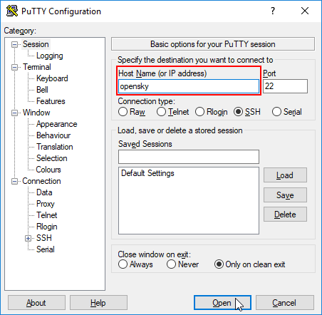 

Click the `Open` button at the bottom. If your receiver was found on the network and you are connecting to it for the first time, then PuTTY will warn you that you are connecting to a new host:

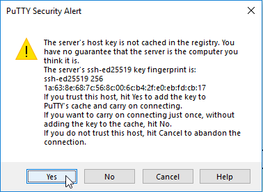 

Since we are aware of that, click the `Yes` button. The connection dialog will open up. First enter the user name `pi` and submit by hitting the return key:

```
login as: pi   
```

Next type the password. Don't worry if the console will show now reaction while you type the password because password inputs are completely hidden:
```
pi@192.168.178.137's password:
```

Hit the return key and you should now be connected to your receiver, which is indicated by the line starting with `pi@opensky:`:

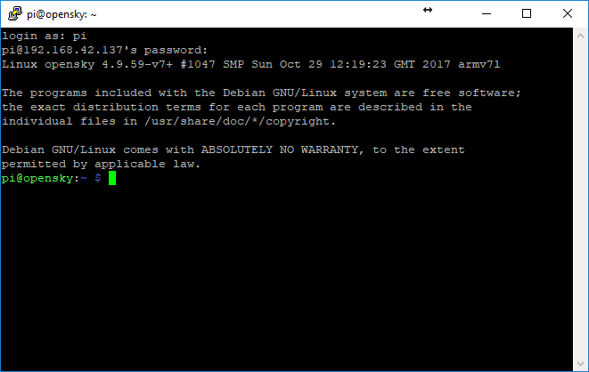 

Continue with the "[Changing Your Password](#changing-your-password)" section!

#### Changing Your Password

As soon as you have established a connection to your receiver via SSH, as described in section "[Connecting via SSH](#connecting-via-ssh)", you can change the password for user `pi` by using the `passwd` command. Type the command, hit the return key and follow the instructions on the screen:

```
pi@opensky:~ $ passwd
Changing password for pi.
(current) UNIX password: 
Enter new UNIX password: 
Retype new UNIX password: 
passwd: password updated successfully
pi@opensky:~ $ 
```

#### Network Setup with "nmtui"

As soon as you have established a connection to your receiver via SSH, as described in section "[Connecting via SSH](#connecting-via-ssh)", you can adjust the network settings with the tool "NetworkManager TUI". Type the command `nmtui`, hit the return key and the following interface should come up:

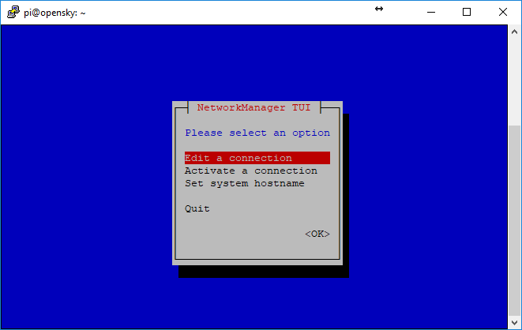 

You can click your way throught the graphical interface using the arrow keys of your keyboard. Since you are trying to update the network configuration this guide will assume you know what you are doing.

**Hint:** The "Activate a connection" option allows you to easily select a wireless network and use the built in WiFi of the RaspberryPi.


## Updating Your Receiver

Updating your receiver basically means overwriting the SD card with a new version of the image you can download [here](https://opensky-network.org/files/downloads/osky-kit_240218.img.xz) ([https://opensky-network.org/files/downloads/osky-kit_240218.img.xz](https://opensky-network.org/files/downloads/osky-kit_240218.img.xz)). This section describes the update process.

### Flashing the Firmware Image

###### Linux

Insert the SD card. It should now show up in the list of block devices, so type the following command:
```bash
lsblk -o NAME,SIZE,TYPE,MOUNTPOINT,LABEL
```


If your SD card is there the output should look something like this:

```
NAME    SIZE TYPE MOUNTPOINT LABEL
sdb    14,9G disk            
├─sdb2 14,8G part            
└─sdb1 41,8M part            boot
sda      80G disk            
└─sda1   80G part /
```

The SD card contains a partition with the label "boot", So the SD card is available at `/dev/sdb`. First make sure the card and none of its partitions are mounted:
```bash
umount /dev/sdb*
```


Switch to your download directory or where ever you wish to download the image file to:
```bash
cd ~/Downloads/
```


Download the image file:
```bash
wget https://opensky-network.org/files/downloads/osky-kit_240218.img.xz
```

Switch to root shell because you could run into problems trying to run `sudo xzcat`:
```bash
sudo -s
```

Now in the root-shell, extract the firmware to the SD card:
```bash
xzcat osky-kit_240218.img.xz > /dev/sdb
```

Flush all pending I/O operations:
```bash
sync
```

**Important:** Since the update process overwrites the SD card, your serial number and username are lost and have to be set prior to the first boot. Please refer to the "[After Updating - Before Powering Up Your Receiver!](#after-updating---before-powering-up-your-receiver!)" section. After having followed these steps, insert the SD card into the receiver and try to power it up.


###### Windows

In order to install the image under Windows we need to install the following software first:

  - [7Zip](http://www.7-zip.de/) - [http://www.7-zip.de/](http://www.7-zip.de/)
  - [Win32 Disk Imager](http://sourceforge.net/projects/win32diskimager) - [http://sourceforge.net/projects/win32diskimager](http://sourceforge.net/projects/win32diskimager)
  
  1. Download and install both programs.

  2. You also need the most recent image file. Download it from [here](https://opensky-network.org/files/downloads/osky-kit_240218.img.xz) ([https://opensky-network.org/files/downloads/osky-kit_240218.img.xz](https://opensky-network.org/files/downloads/osky-kit_240218.img.xz)) using your favorite browser. 
  
  3. Insert the SD card. One partition can't be read with Windows, which is why it will probably ask you to format it. Click "Cancel":  
     
   The card should now show up in your Windows Explorer in the section "This PC" as the partitions "boot" and "SD Card":  
     
  3. First we will prepare the SD card by removing all partitions. Open the Windows Disk Management: Press Windowskey-R, then type `diskmgmt.msc` and finally press the return key. The program coming up should look like this:  
   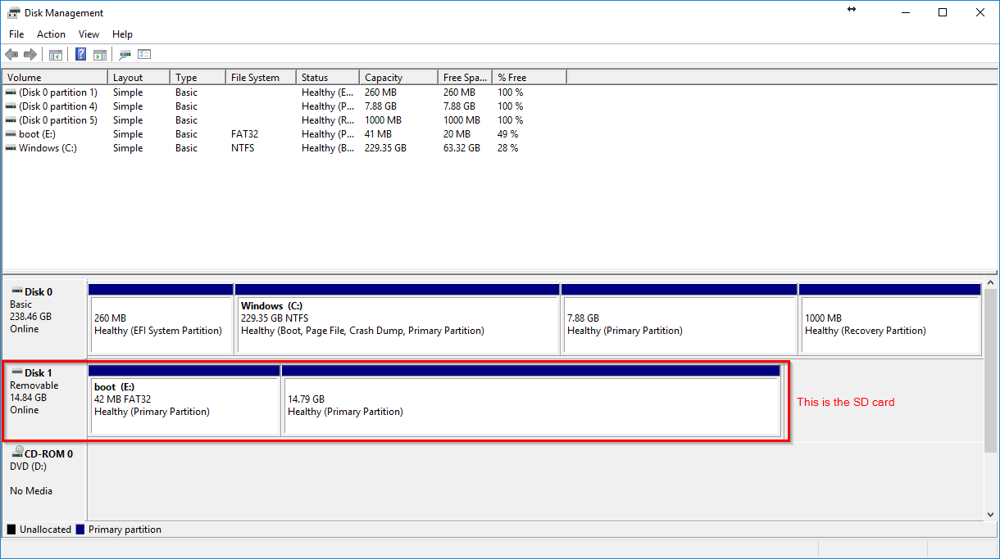  
  The SC card is labeled `Removable` on the left and should have the two partitions we just saw on the Windows Explorer (marked with a red square in the image above). Make sure you determine the correct device because you don't want to format other removable USB devices you probably have connected to your PC at that moment. Right-click both partitions one at a time and click `Delete Volume` in the context menu:  
   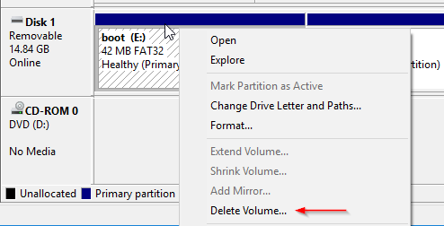  
  After removing both partitions the whole SD card should be "Unallocated".
  
  4. Next we will extract the image file using 7Zip. Navigate to the directory you downloaded the file to (or click `Show in folder` in the download section of your browser). Right-click the file and select `Extract to "osky-kit_240218.img\"` in the 7 Zip sub-menu:  
   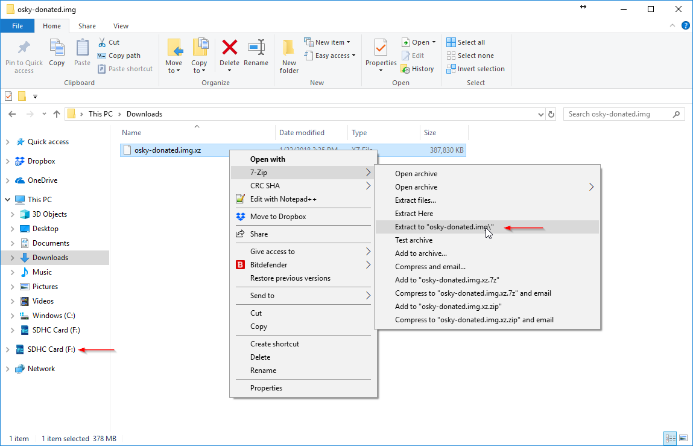  
  This will create a new folder and write the image file to that folder. You probably also noticed the red arrow on the left in the image above. There you see the current letter Windows assigned to the empty SD card, `(F:)` in this case. We will need this letter in the next step.

  5. Open the Win32 Disk Imager you just installed. Please note that the program refreshes available devices when it starts up and you should therefore only start it now. If you already had it running while you were formatting the SD card you should close the Disk Imager and restart it. Once you have selected the image file we just created with 7 Zip in the last step, the window should look like this:  
   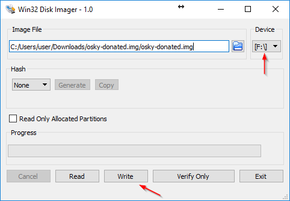  
  Make sure the correct device is selected in the dropdown menu on the right, `(F:)` in this case. The `Write` button on the bottom should become activated. Click it and confirm to start the writing process. After a few minutes it should have finished.
  
  6. Safely remove the SD card to flush all pending I/O operations by selecting the device in the eject menu in the Windows Infobar on the bottom right of your screen. The eject menu is available by right-clicking the small USB stick icon:  
   
  
  7. **Important:** Since the update process overwrites the SD card, your serial number and username are lost and have to be set prior to the first boot. Please refer to the "[After Updating - Before Powering Up Your Receiver!](#after-updating---before-powering-up-your-receiver!)" section.

  8. Insert the SD card into the receiver and try to power it up.
  
### After Updating - Before Powering Up Your Receiver!

Flashing the firmware image to the SD card will overwrite all changes you made since you first got it. Please refer to the "[Preparing The SD Card](#preparing-the-sd-card)" section for details on how to set the **receiver position** and your OpenSky Network **user name**.

When you powered your receiver up for the very first time, a unique serial number was automatically generated for it by the OpenSky Network. This serial number identifies your receiver. Since all settings are overwritten by flashing the image to the SD card, you now additionally have to set the serial number that was assigned to it when it connected to the OpenSky Network for the first time. Else your receiver will get a new serial number and will show up as a new receiver in "My OpenSky".

##### Receiver Serial

 This step describes how you can set the serial number of your receiver to prevent it from getting added as a new device. In case you are not sure what the serial number of your receiver was before you flashed the image to the SD card, you can simply log into the OpenSky Network with your favorite browser and check the "My OpenSky" section or the receiver profile. Your serial number is listed there.

  Switch to the SD card and open the file `opensky/serial.txt`. The file should look like this:
  
  ```
  # If you have used this device before and just updated
  # the firmware, enter the serial number of your previous
  # setup here in order to reuse it.
  
  # Note: remove the '#' character before 'serial'
  
  [Device]
  #serial = [enter your previous serial here]
  ```
  
  Edit the last line and insert your serial number. In this example the serial number is `-1408237066`:
  
  ```
    [Device]
    serial = -1408237066
  ```

  Make sure you don't forget to remove the "#" at the beginning of the line. When you now power up your receiver it will show up in your My OpenSky section as the same receiver it was before you updated the image.

## Antenna Positioning

A good position to mount your antenna is essential for good reception. Radio signals are blocked by surrounding buildings and terrain. In order to get good results your antenna should be mounted as high as possible, with a clear line of sight in every direction.

  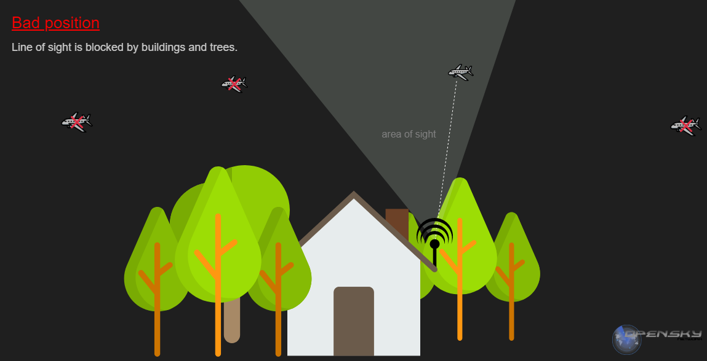
  
  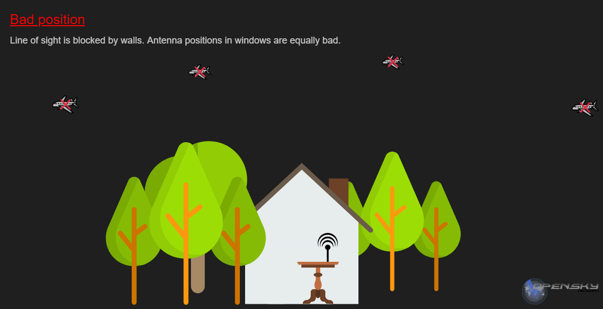 
  
  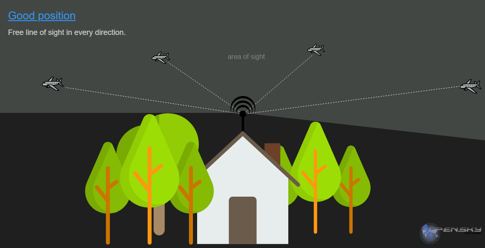 
  
   
  
  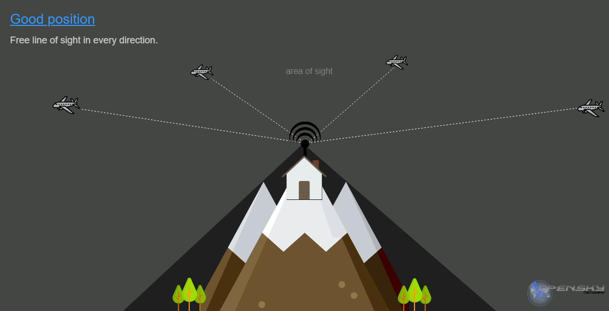
