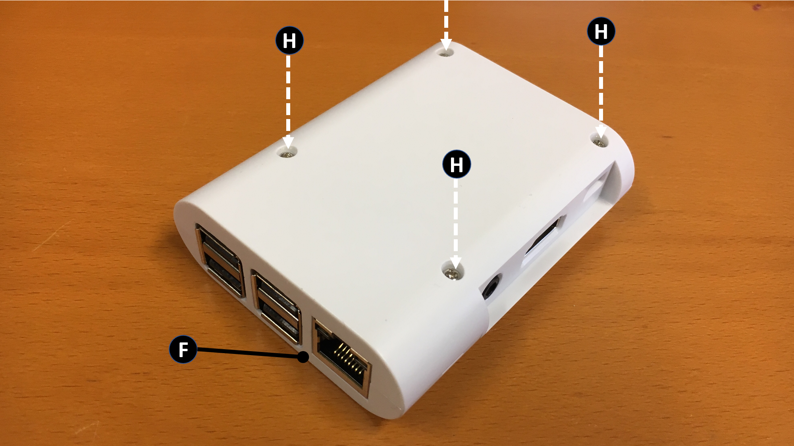
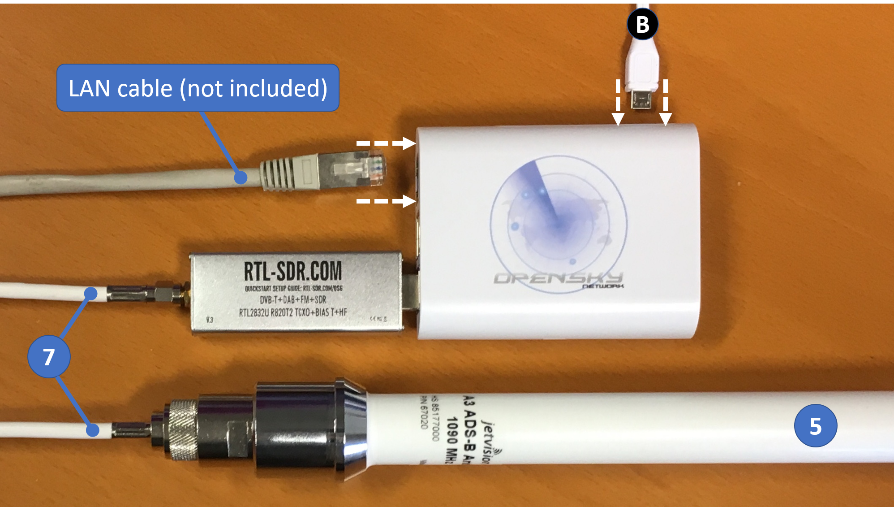
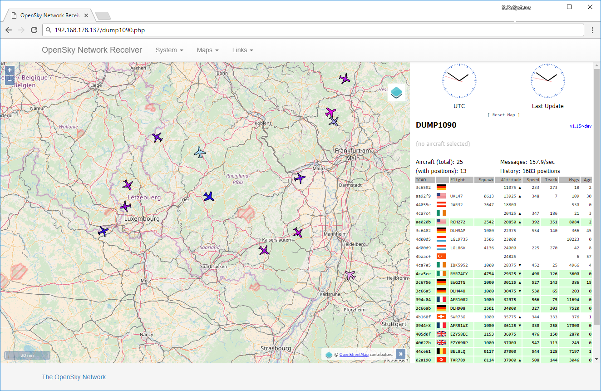
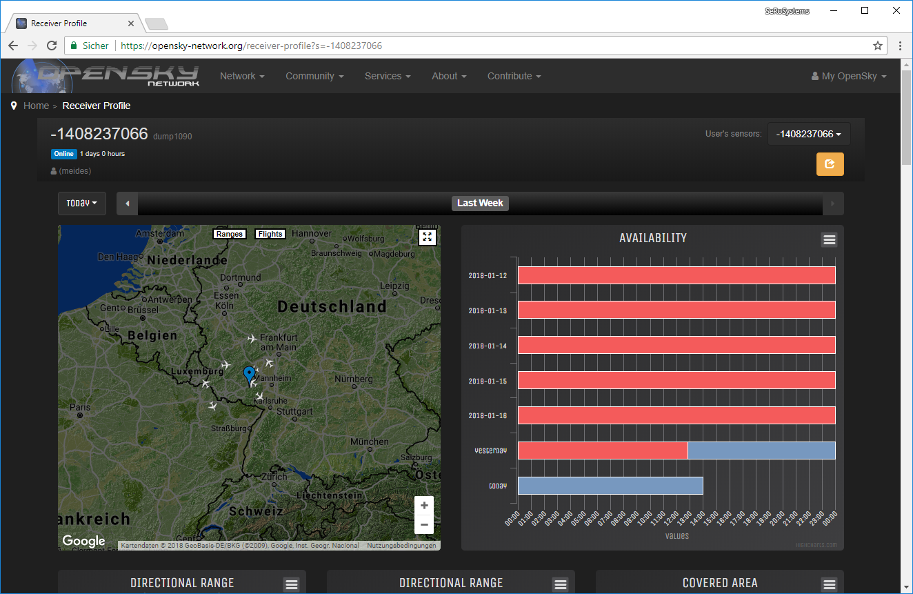

## Contents

  * Introduction
  * Overview
  * Assembling the receiver
  * Bringing your Receiver Online
    * Network Setup
    * Accessing the web interface of the receiver

-----

## Introduction

This guide explains how to assemble and setup your OpenSky Network Kit. After following this guide your kit will be connected to the OpenSky Network and you will be able to view the data the receiver is collecting by logging into your OpenSky profile on [https://opensky-network.org](https://opensky-network.org).

## Overview


The OpenSky kit consists of the following parts:

##### (1) The RaspberryPi
  * 1x RaspberryPi 3 Model B *(A)*
  * 1x RaspberryPi Universal Power Supply *(B)*
  * 1x big chip cooler *(C)*
  * 1x small chip cooler *(D)*
  
##### (2) The Case
  * 1x OpenSky RaspberryPi case *(E)*, *(F)*, *(G)*
  * 4x screws + 1x spare screw *(H)*
  
##### (3) 1x SD card containing the OpenSky receiver image

##### (4) 1x RTL-SDR USB dongle

##### (5) 1x Jetvision A3 ADS-B antenna 1090 MHz

##### (6) 1x Antenna mounting backet

##### (7) 1x 15m low loss coax cable

## Assembling the receiver

Remove the protection cardboard from the bottom of the coolers (C) and (D) and place them onto the chips of the RaspberryPi (A):

 

Take the RPi (A) and place it onto the bottom part of the case (E). You will notice that the four screwholes of the RPi will be aligned with the screwholes in (E). The best way to insert the RPi is to push the 3.5 mm audio jack into the designated hole in the case (see the red circle below) and then push down the RPi, until it sits perfectly.

 

Gently push the rear panel (G) of the case into position and make sure the SD card slot is on the bottom (see the red circle below).

 

Place the top part of the case (F) onto the RPi and insert the screws (H) through the holes on the bottom.

 

Insert the SD card (3):

 

Remove the plastic caps from the RTL-SDR dongle (4) and plug it into one of the USB ports on the RaspberryPi:

 

Connect the coax cable (5), the power supply (B) and your local network via a LAN cable. The LAN cable is not included in the OpenSky kit:

 

The RaspberryPi should be powering up, which is indicated by an LED behind the rear panel of the case or the LAN traffic indicators on the LAN port.

## Bringing your Receiver Online

##### Network Setup

The receiver is configured to attempt a connection via DHCP, which is the appropriate configuration in most cases. Simply connect the receiver to your local network via a LAN cable and moments later it should automatically have established a connection. If your LAN has access to the Internet the receiver will instantly start streaming data to the OpenSky Network. If your network operates without a DHCP server or you wish to use some other configuration, please contact us via [contact@opensky-network.org](mailto:contact@opensky-network.org).

##### Determine the IP Address of Your Receiver

To access the web interface of the receiver you need to find out its IP address. In case it was assigned by a DHCP server your best bet is to search the network for a host called `raspberrypi` because that is the default hostname of your receiver when you set it up. The command `nslookup` is preinstalled on Windows, Ubuntu and Mac OS X. Unless you have not set up some specific outside-LAN DNS server for your computer, this command should do the trick. Follow these steps to get the IP address:

###### Linux

 1. Open a terminal 
 2. a) type `nslookup raspberrypi`
   
    b) In case `nslookup` is not installed on your Linux distribution, try `getent hosts raspberrypi | awk '{ print $1 }'`. The command should print the IP address of your receiver to the console, for example `192.168.178.137`.

###### Windows

 1. Open the command shell. You can either 
    
    a) press Windowskey-R, then type `cmd` and finally press the return key
    
    b) *or* open the Windows start menu, then type `cmd` and finally press the return key
    
 2. When the command line shell has opened up, type `nslookup raspberrypi` and submit the command by pressing the return key
 
##### Mac OS X

 1. Open the terminal. Press CMD-Space, type `Terminal` and select the Terminal app.
 
 2. When the terminal has opened up, type `nslookup raspberrypi` and submit the command by pressing the return key
 
-----
  
The `nslookup` command should print some information to the console, which should look somewhat like this:

 

In this case the IP address of your receiver would be `192.168.178.137`.

##### Accessing the web interface of the receiver

Open up your favorite internet browser and type the ip address to the address line. The webinterface should open up:

 

In the "Links"-menu you will find the option "Your OpenSky Receiver Profile". Click it and your public OpenSky Network profile will open up: 


 

The big number on the top left is the serial number of your receiver. In the image above the serial number is `-1408237066`. Don't be surprised to find the user `matze` assigned to your receiver because all new receivers are. Please contact us at [contact@opensky-network.org](mailto:contact@opensky-network.org) to claim your receiver so we can assign it to your OpenSky Network account. For your convenience we have prepared this email text for you. Just fill out the missing information:

```
Dear OpenSky team,

my new receiver just went online and I would like to claim it:

 serial: <YOUR SERIAL NUMBER>
 username: <YOUR OPENSKY NETWORK USERNAME>
 
Cheers!
```